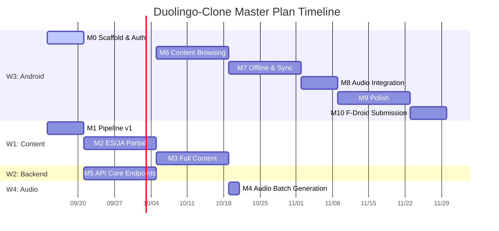

# Duolingo-Clone: Master Plan

**Date:** 2026-09-14
**Status:** Executive plan — synthesizes three design docs into one executable roadmap
**Source documents:**
- `docs/android-architecture.md` — native Android app design (Kotlin/Compose, Clerk, Room)
- `docs/content-sourcing.md` — real course content pipeline (Spanish + Japanese)
- `docs/kokoro-tts.md` — Kokoro-82M TTS evaluation and pre-generation recommendation

---

## 1. Executive Summary

**Goal:** Transform the existing Next.js toy Duolingo clone (single Spanish course, repeated challenge templates) into a production-grade language learning app with **real Spanish and Japanese courses, real native-quality audio, and a native Android client** — all backed by one shared Postgres database and versioned API.

### The Four Workstreams

| # | Workstream | Deliverable | Source doc |
|---|-----------|-------------|------------|
| W1 | Content pipeline | Real Spanish (A1–B2) + Japanese (N5–N2) course trees with varied exercises | `content-sourcing.md` |
| W2 | Backend v1 API | `/api/v1/*` REST layer for Android client | `android-architecture.md` §3 |
| W3 | Native Android client | Kotlin/Compose app with Clerk auth, Room offline cache | `android-architecture.md` §1–§5 |
| W4 | Audio generation | Kokoro-82M pre-generated Ogg Opus files on CDN (Spanish + Japanese) | `kokoro-tts.md` §3, §7 |

### Duration and Effort

- **Solo developer:** ~16 weeks (~4 person-months) on the critical path
- **Two developers (recommended):** ~8 weeks by running W1/W2/W4 in parallel with W3
- **Total effort:** ~1680–2380 developer-hours across all workstreams
- **Critical path:** W3 Phase 0 → W1 (pipeline + content) → W4 (audio) → W2 (API) → W3 (app phases) → F-Droid submission

### Honest Verdict

This is a serious engineering effort. The riskiest elements are:
1. **Content quality** — auto-generated exercises must pass human review to feel hand-crafted
2. **Japanese TTS quality** — Kokoro's Japanese voice (`jf_alpha`) is good but not as polished as its Spanish voice (`ef_dora`)
3. **Offline sync conflicts** — multi-device edge cases are genuinely hard to test exhaustively

The good news: all three design docs are complete, technically sound, and cite real benchmarks. This plan has no major unknowns — it's execution risk, not discovery risk.

---

## 2. Current State vs Target State

| Dimension | Current | Target |
|-----------|---------|--------|
| **Courses** | 1 toy Spanish course (2 units, repeated SELECT challenges) | Real Spanish (A1–B2) + Japanese (N5–N2) courses from licensed sources |
| **Exercise types** | SELECT and ASSIST only | SELECT, ASSIST, TRANSLATE, LISTENING, WORD_BANK, MATCHING, KANJI_READ, CLOZE |
| **Audio** | None (placeholder MP3 paths) | Kokoro-82M generated Ogg Opus at 24kHz, served from CDN with 1-year immutable cache |
| **Backend** | Next.js Server Actions → Drizzle → Postgres | Same + `/api/v1/*` REST layer for Android |
| **Auth** | Clerk (web only) | Clerk for web + TBD Android auth approach (same user pool) |
| **Client** | Next.js web app | Web app + native Kotlin/Compose Android app (offline-first) |
| **Offline** | None | Room DB caches course tree + progress; audio cached per lesson |
| **API contract** | None (internal Server Actions) | Versioned `/api/v1/*` with documented JSON shapes |

---

## 3. Target Architecture

```
┌─────────────────────────────┐
│  CONTENT SOURCES (offline)  │
│ Tatoeba, Wiktionary, EDRDG  │
│ JMdict/JMnedict/KANJIDIC2   │
│ JLPT lists, frequency lists │
└─────────────┬───────────────┘
              │ ingest + normalize
              ▼
┌─────────────────────────────┐
│  CONTENT PIPELINE (Python)  │  W1
│ FETCH → NORMALIZE → DEDUPE  │
│ → TIER → GROUP → EXERCISE   │
│ GEN → VALIDATE → INSERT     │
└─────────────┬───────────────┘
              │ INSERT course_tree
              ▼
   ┌─────────────────────────────────────┐
   │        PostgreSQL (Neon)             │
   │  course_tree: courses, units, lessons│
   │  challenges, challenge_options, users│
   │  user_progress, challenge_progress, │
   │  challenges, challenge_options, users│
   │  user_progress, challenge_progress   │
   ┌──────────────┴──────────────────────────────────┐
   │     Next.js Backend (existing + new)             │
   │                                                  │
   │  app/api/v1/*          W2                        │
   │  ├── GET    /courses                    (public) │
   │  ├── GET    /course/:id                  (auth)  │
   │  ├── GET    /lesson/:id                  (auth)  │
   │  ├── POST   /challenge/:id/progress      (auth)  │
   │  ├── GET    /me                           (auth) │
   │  ├── GET    /hearts                       (auth) │
   │  ├── GET    /quests                       (auth) │
   │  └── GET    /leaderboard                  (auth) │
   │  Admin panel (unchanged)                         │
   └──────┬──────────────────────────────────┬───────┘
          │ HTTPS JSON                       │
          ▼                                  ▼
┌──────────────────┐              ┌─────────────────────────┐
│  WEB APP         │              │  ANDROID APP (W3)        │
│  (Next.js,       │              │  Kotlin + Jetpack Compose│
│   unchanged)     │              │                          │
│                  │              │  Clerk Android SDK auth  │
│                  │              │  Retrofit + OkHttp       │
│                  │              │  Room offline cache      │
│                  │              │  WorkManager sync        │
│                  │              │  Media3 ExoPlayer audio  │
└──────────────────┘              └────────────┬────────────┘
                                               │ CDN audio URLs
                                               ▼
            ┌─────────────────────────────────────┐
            │   CDN (Cloudflare R2 / S3+CF)        │
            │   /audio/es/<challengeOptionId>.ogg  │
            │   /audio/ja/<challengeOptionId>.ogg  │
            │   Cache-Control: public,             │
            │     max-age=31536000, immutable      │
            └───────────────▲─────────────────────┘
                            │
            ┌───────────────┴─────────────────────┐
            │   AUDIO GENERATION (offline)    W4   │
            │   Kokoro-82M on local CPU            │
            │   es: ef_dora | ja: jf_alpha         │
            │   WAV → ffmpeg → Ogg Opus 48kbps     │
            └─────────────────────────────────────┘
```

---

## 4. Workstreams

### W1: Content Pipeline

**Owner skill:** Python developer comfortable with text processing, JSONL, XML parsing, and SQL.

**Inputs:**
- Tatoeba custom export (spa↔eng and jpn↔eng sentence pairs)
- Wiktionary pre-parsed JSONL (eswiktionary, jawiktionary) from kaikki.org
- EDRDG JMdict_e.gz, JMnedict.gz, KANJIDIC2.gz
- Hermit Dave frequency lists (es_50k.txt, ja_50k.txt)
- JLPT vocabulary lists (N5–N2 CSVs)

**Outputs:**
- Populated `course_tree` tables in Postgres: 2 courses, 8 units each, 6–8 lessons per unit, 5–7 challenges per lesson
- ~4000–6000 challenge rows, ~12000–18000 challenge_options rows
- `content/ATTRIBUTION.md` (auto-generated)

**Dependencies:** None. Can start immediately.

**Duration:** ~3–4 weeks (100–150 hours per `content-sourcing.md` §8)

**Key risk:** Auto-generated exercise quality; needs human review of first 1–2 units before bulk generating.

---

### W2: Backend v1 API + Schema Migration

**Owner skill:** Node.js/TypeScript developer with Next.js and REST API design experience.

**Inputs:**
- W1 output: populated course data
- Clerk configuration (existing)

**Outputs:**
- `app/api/v1/courses/route.ts` (public GET)
- `app/api/v1/course/[id]/route.ts` (GET with progress)
- `app/api/v1/me/route.ts` (GET profile, POST select course)
- `app/api/v1/me/progress/route.ts` (GET)
- `app/api/v1/lesson/[id]/route.ts` (GET)
- `app/api/v1/challenge/[id]/progress/route.ts` (POST)
- `app/api/v1/hearts/route.ts` (GET, POST /refill)
- `app/api/v1/quests/route.ts` (GET)
- `app/api/v1/leaderboard/route.ts` (GET)
- **Cleanup:** Delete the web app's Stripe checkout integration (obsolete under the free model)

**Dependencies:** Clerk Android SDK integration (W3 Phase 0) to test auth flow end-to-end.

**Duration:** ~2 weeks

**Key risk:** API endpoint coverage — must expose everything the Android app needs.

---

### W3: Native Android App

**Owner skill:** Android developer (Kotlin, Jetpack Compose, Hilt, Retrofit, Room, WorkManager).

**Inputs:**
- W2 output: `/api/v1/*` endpoints documented and working
- W4 output: CDN audio URLs in challenge_options table
- Clerk Android SDK configuration
- Client repo licensed under a free (FOSS) license; F-Droid submission (no developer fee)

**Outputs:**
- `duo-android/` Kotlin project with modules per `android-architecture.md` §6
- Screens: Splash, Auth, Courses, Learn (unit tree), Lesson quiz, Quests, Leaderboard, Profile
- Offline-first with Room DB sync via WorkManager
- Audio playback via Media3 ExoPlayer with DownloadManager caching
- CI/CD: lint → unit test → connected test → signed APK (F-Droid); no third-party app distribution

---

### W4: Audio Generation + CDN

**Owner skill:** Any developer; runs locally on dev machine (no special hardware).

**Inputs:**
- W1 output: all challenge_options with `text` and `lang` fields populated
- Kokoro-82M model installed (verified working on dev machine)
- CDN bucket (Cloudflare R2 or S3 + CloudFront)

**Outputs:**
- ~1000–1500 Ogg Opus files uploaded to CDN at `/audio/{lang}/{challengeOptionId}.ogg`
- Updated `challenge_options.audio_src` in database pointing to CDN URLs
- `migration.sql` that rewrites existing audio paths to new scheme

**Dependencies:** W1 (needs final content). Can start with W1 sample output for early validation.

**Duration:** ~1–2 days batch generation + upload time

**Key specs (verified, `kokoro-tts.md` §4):**
- Spanish voice: `ef_dora` — 611ms warm synth, 1737ms cold
- Japanese voice: `jf_alpha` — 808ms warm synth, 1756ms cold
- Output: 24kHz mono WAV → ffmpeg → Ogg Opus 48kbps
- Japanese G2P: pyopenjtalk + unidic; Spanish: espeak-ng via misaki
- Estimated file size: ~300 bytes per second of audio (~50KB average per clip)

---

## 5. Unified Critical Path

### Milestones

| Milestone | Name | Workstreams | What "Done" Means | Duration |
|-----------|------|-------------|-------------------|----------|
| **M0** | Scaffold & auth spike | W3 (Phase 0) | Empty Compose project launches, Clerk SDK wired, `/me` endpoint returns user | 1 week |
| **M1** | Content pipeline v1 | W1 | Pipeline scripts run end-to-end on sample data; produces valid JSON exercise files; 1 test unit inserted into DB | 1 week |
| **M2** | Content bulk generation | W1 | Full course tree generated for ES A1-A2 and JA N5-N4 (16 units); all quality checks pass | 2 weeks |
| **M3** | Content full generation | W1 | Full course tree for ES A1-B2 and JA N5-N2 (16 units); all ~15k exercise options generated and validated | 2 weeks |
| **M4** | Audio batch generation | W4 | All challenge_options have corresponding Ogg Opus files uploaded to CDN; `audio_src` paths updated in DB | 2 days |
| **M5** | API v1 core endpoints | W2 | All `/api/v1/*` endpoints implemented and tested with curl/Postman; auth, course browsing, lesson, challenge progress working | 2 weeks |
| **M6** | Android content browsing | W3 (Phase 1-2) | App browses real course tree from API; lesson quiz screen renders challenges; progress saves | 2 weeks |
| **M7** | Offline + sync | W3 (Phase 3) | Kill network, complete lesson, restore network → progress appears on web app; conflict resolution tested | 2 weeks |
| **M8** | Audio integration | W3 (Phase 4) | Audio plays for each challenge option; DownloadManager pre-caches lessons; offline playback works | 1 week |
| **M9** | Polish & hardening | W3 (Phase 6) | Animations, error states, empty states, accessibility, ProGuard, multi-device testing | 2 weeks |
| **M10** | F-Droid submission | W3 (Phase 7) | Client FOSS-licensed; APK built from source, submitted to F-Droid and passes review; no proprietary analytics | 1 week |

### Parallel Work Streams (Gantt)

```
Week:   1    2    3    4    5    6    7    8    9    10   11   12   13   14   15   16
W3 P0:  [M0 scaffold/auth]
W1:     [M1 pipeline]──[M2 ES/JA partial]──[M3 full content]────
W4:                                              [M4 audio batch]──
W2:                [M5 API core]────────────────────────────────────────────────────
W3 P1-P2:                      [M6 content browse]───
W3 P3:                                        [M7 offline/sync]────
W3 P4:                                                [M8 audio]───
W3 P7:                                                              [M9 polish]
W3 P8:                                                                    [M10 submit]
```

**Critical path (sequential):** M0 → M1 → M2 → M3 → M4 → M5 → M6 → M7 → M8 → M9 → M10
- **Solo developer:** ~16 weeks (critical path dominates; W1 and W2 can partially overlap)
- **Two developers:** ~8 weeks (one on W3 Android app, one on W1+W2+W4 backend + content)

### Mermaid Gantt



---

## 6. Key Technical Decisions

### Auth: Clerk for Both Web and Android

- Web app: Clerk Next.js middleware (`@clerk/nextjs`) — existing
- Android app: official Clerk Android SDK (`com.clerk:clerk-android-api`, MIT — F-Droid-compatible)
  - `com.clerk:clerk-android-api` / `clerk-android-ui` exist on Maven Central (latest 1.1.6, MIT, verified 2026-09-14)
  - Requires the Clerk "Native API" enabled under Native Applications in the dashboard
- Same Clerk instance, same user pool — users sign in with same credentials on both
- Clerk generates opaque `sessionToken`; Android sends it as Bearer token to API
- Next.js API routes decode Clerk JWT → `req.user`
- Android app receives user ID and profile, not JWT secret

### Content Storage: Repurpose Existing `challenge_options.audio_src`

- No new columns needed
- Store CDN URL: `https://cdn.example.com/audio/es/<challengeOptionId>.ogg`
- Client checks `audio_src` is non-null before attempting playback.
- Migration script updates existing audio paths in database

### Pre-generated Audio vs. Runtime TTS

**Decision: Pre-generate all audio to CDN.** (Per `kokoro-tts.md` §3 and benchmarks in §4.)

| Approach | Latency | Cost | Complexity | Verdict |
|----------|---------|------|------------|---------|
| Pre-generate to CDN | <50ms (CDN edge) | Free (local CPU) | Simple upload | ✅ Chosen |
| Server-side Kokoro API | 300–500ms | $/hour | Queue management | Overkill |
| Client-side Kokoro | 600–800ms | Free | Large model (82M) | Too slow |

### No Monetization

- The app is entirely free. There is no billing, in-app purchase, subscription, advertising or paywall — by design.
- The Shop screen is dropped: it existed only to sell heart refills and unlimited hearts.
- Hearts remain a free mechanic, refilled by completing a practice/review lesson.
- The web app's Stripe integration (`lib/stripe.ts`, `actions/user-subscription.ts`, `app/api/webhooks/stripe`, and the shop/promo components) is deleted as part of the backend workstream.

---

## 7. Licensing & Compliance

### Content Licenses

| Source | License | Commercial? | Obligation |
|--------|---------|-------------|------------|
| Tatoeba (text) | CC BY 2.0 FR | Yes | Attribution |
| Wiktionary / kaikki.org | CC BY-SA 3.0/4.0 | Yes | Attribution + share-alike |
| JMdict / JMnedict / KANJIDIC2 (EDRDG) | EDRDG Dictionary License (CC BY-SA 4.0-compatible) | Yes | Attribution to EDRDG + link https://www.edrdg.org/ |
| Hermitdave FrequencyWords | MIT | Yes | Attribution |
| Mozilla Common Voice (optional audio) | CC0 1.0 | Yes | None (appreciated) |
| OPUS corpora | Varies per sub-corpus | Check | Per sub-corpus |

Source of truth: `content-sourcing.md` Appendix (License Summary).

### Audio Licenses

| Source | License | Obligation |
|--------|---------|------------|
| Kokoro-82M model weights | Apache-2.0 | Standard |
| misaki (G2P) | Apache-2.0 | Standard |
| espeak-ng | BSD | Standard |
| pyopenjtalk | LGPL-2.1 | Dynamic link only; do not statically link |
| unidic dictionary | LGPL-2.1 | Dynamic link only; do not statically link |

Source of truth: `kokoro-tts.md` §5.

**Scope note:** these LGPL components live only in the offline Python audio-generation toolchain. The shipped Android app plays pre-generated audio files, so no LGPL code is distributed in the APK. Re-verify if any LGPL component is ever embedded in the app.

### Required Attribution

Add to the Settings → About screen:

```
Course content sourced from Tatoeba (CC BY 2.0 FR), Wiktionary/kaikki.org (CC BY-SA 3.0/4.0),
and EDRDG dictionaries (JMdict/JMnedict/KANJIDIC2, CC BY-SA 4.0-compatible).
Frequency data from Hermitdave FrequencyWords (MIT).
Audio generated with Kokoro-82M (Apache-2.0).
```

Also write `content/ATTRIBUTION.md` in the repo (generated by the pipeline).

### CJK Font

- Android ships a CJK system font on most devices. If guaranteed coverage is required, bundle **Noto Sans JP (SIL OFL 1.1)** in the app.
- **KanjiVG (CC BY-SA 3.0) is SVG stroke-order data, NOT a font.** Use it only if you build stroke-order exercises, and attribute accordingly.

---

## 8. Risks & Mitigations

| Risk | Impact | Probability | Mitigation |
|------|--------|-------------|------------|
| Auto-generated Japanese exercises are low quality | High | High | Human review of all N5 content before generating N4+ |
| Kokoro Japanese voice quality is poor | Medium | Medium | Listen to the verified sample (`.scratch/samples/ja.wav`, voice `jf_alpha`) and compare voices before bulk generation |
| CDN upload of 1500 files times out | Low | Low | Use parallel upload with retry; batch in groups of 50 |
| Content generation script crashes mid-way | Medium | Low | Implement transactional inserts with savepoints |
| Japanese kanji rendering broken on some devices | Medium | Medium | Bundle Noto Sans JP if coverage gaps found; test on API 26–34 emulators |
| F-Droid review rejects the app (licensing / non-FOSS / telemetry) | Medium | Low | Client under a free license, all deps FOSS, no proprietary libs or telemetry; add human-written intro text per unit |

---

## 9. Cost Estimate

### One-Time Costs

| Item | Estimate |
|------|----------|
| Kokoro TTS audio generation | $0 (local CPU) |
| CDN upload (Cloudflare R2) | $0 (free tier sufficient for <10GB) |
| Developer accounts | $0 (use existing) |

### Monthly Operating Costs

| Item | Estimate (10k MAU) |
|------|-------------------|
| Neon Postgres | ~$35/mo (Starter plan) |
| Vercel hosting | ~$20/mo (Pro plan) |
| Cloudflare R2 storage + bandwidth | ~$5–10/mo |
| Clerk (free up to 100k MAU) | $0 |
| **Total** | **~$60–65/mo** |

There is no revenue: the app is free, with no billing, subscriptions or advertising.

---

## 10. First Steps (This Week)

1. **Set up Android project** (`duo-android/`) with empty Compose layout that launches
2. **Wire auth with the official Clerk Android SDK** (`com.clerk:clerk-android-api:1.1.6`, MIT) and the `/api/v1/me` endpoint
3. **Start content pipeline** (`content/`) with Tatoeba export for Spanish A1 vocabulary
4. **Generate first batch of Kokoro audio** (Spanish only) and upload to test CDN bucket
5. **License the client** (e.g. Apache-2.0) and prepare the F-Droid submission — F-Droid builds from source and signs the APK; there is no developer account or fee

---

## Appendix A: API Endpoint Specifications

| Method | Path | Auth | Description |
|--------|------|------|-------------|
| GET | `/api/v1/courses` | Public | List all available courses |
| GET | `/api/v1/course/:id` | Auth | Get course with units, lessons, progress |
| GET | `/api/v1/lesson/:id` | Auth | Get lesson with all challenges |
| POST | `/api/v1/challenge/:id/progress` | Auth | Submit challenge attempt result |
| GET | `/api/v1/me` | Auth | Get user profile |
| GET | `/api/v1/me/progress` | Auth | Get overall progress stats |
| GET | `/api/v1/hearts` | Auth | Get hearts remaining |
| POST | `/api/v1/hearts/refill` | Auth | Refill hearts by completing a practice lesson |
| GET | `/api/v1/quests` | Auth | Get active quests |
| GET | `/api/v1/leaderboard` | Auth | Get leaderboard standings |

### Error Format

All API errors return:
```json
{
  "error": "human-readable message",
  "code": "MACHINE_READABLE_CODE",
  "status": 400
}
```

Common error codes:
- `UNAUTHORIZED` (401): Clerk token invalid or expired
- `NOT_FOUND` (404): Resource doesn't exist
- `BAD_REQUEST` (400): Invalid payload
- `RATE_LIMITED` (429): Too many requests

---

*Master plan generated 2026-09-14. Synthesizes android-architecture.md, content-sourcing.md, kokoro-tts.md.*